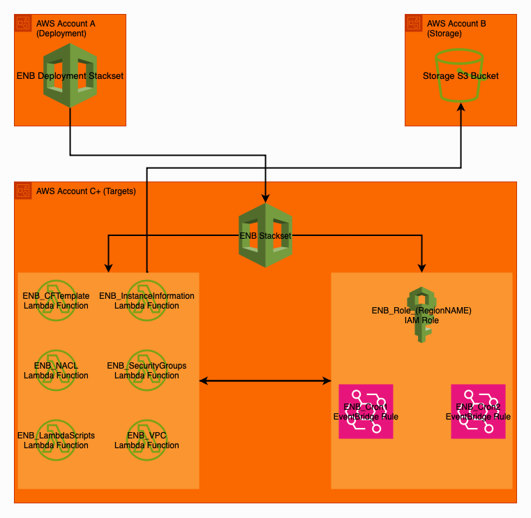

<h1 style='Text-align:center; color:white; padding: 20px;'> Enhanced Network Backups </h1>

### 📃 Architecture 

## 📝 Summary
---
The CloudFormation template will deploy the following:
<li>'ENB_CFTemplates - Lambda to backup CloudFormation templates</li>
<li>'ENB_InstanceInformation - Lambda to backup EC2 Instance information</li>
<li>'ENB_NACL - Lambda to backup Network ACL's</li>
<li>'ENB_SecurityGroups - Lambda to backup EC2 Security Groups</li>
<li>'ENB_VPC - Lambda to backup VPC Information</li>
<li>'ENB_LambdaScripts' - Lambda to backup all Lambda functions </li>
 
The above will be triggered at the same time and generate various JSON config files for AWS services.
 
The JSON files will then be uploaded to an S3 bucket.

### 🧪Instructions
---
<li> Deploy stack/stackset in master account. </li>
<li> Add parameters for the bucket name and customer name.   </li>
<li> Create Lifecycle Management policy in the S3 bucket. </li>
<li> Enable PutObject from the account(s) to the destination bucket. </li>

### 🔐Security
---
The following permissions are automatically created in the customer accounts:
<li> ec2:DescribeInstances </li>
<li> ec2:DescribeNetworkAcls </li>
<li> ec2:DescribeSecurityGroups </li>
<li> sts:GetCallerIdentity </li>
<li> s3:PutObject </li>
<li> logs:CreateLogGroup </li>
<li> logs:CreateLogStream </li>
<li> logs:PutLogEvents </li>
<li> lambda:ListFunctions </li>
<li> lambda:GetFunction </li>
<li> cloudformation:DescribeStacks </li>
<li> cloudformation:GetTemplate </li>
<li> cloudformation:ListStacks </li>
<li> ec2:DescribeVpcs </li>
<li> ec2:DescribeSubnets </li>
<li> ec2:DescribeRouteTables </li>
<li> ec2:DescribeNatGateways </li>
<li> ec2:DescribeVpcPeeringConnections </li>
<li> ec2:DescribeAddresses </li>

### 👨‍💻 Author
---
Tom Bindloss

